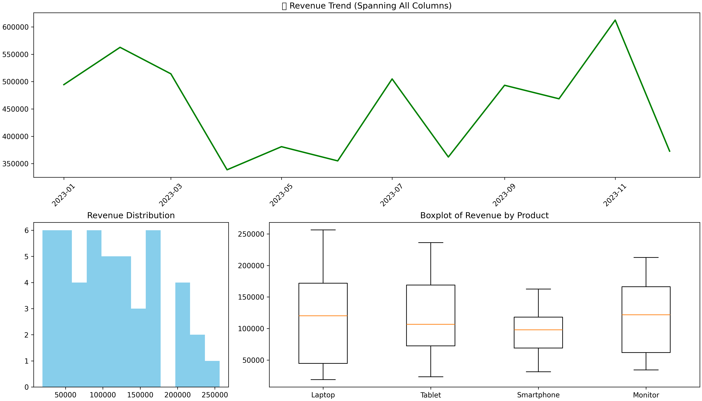
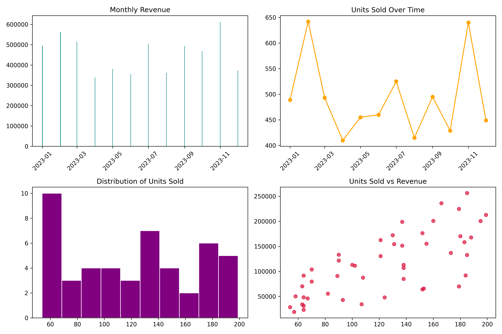

# 📊 MatplotlibMasterPro

[](https://www.gnu.org/licenses/gpl-3.0)
[](https://www.python.org/)
[](https://jupyter.org/)
[](https://matplotlib.org/)
[](#)
[](#)
[](#)
[](#)
[](#)
[](#)
[](#)

---

## 🧠 Project Overview

**MatplotlibMasterPro** is a complete, portfolio-grade project designed to **master data visualization using `matplotlib.pyplot`**.  
It’s structured to serve both as a:

- 📘 **Self-paced learning notebook series**
- 💼 **Professional showcase project**

Whether you’re revisiting fundamentals or creating complex dashboards — this project brings it all together in one place.

---

## 📁 Project Structure

```bash
MatplotlibMasterPro/
├── notebooks/               # Step-by-step concept notebooks
├── utils/                   # Plotting utility scripts
├── cheatsheets/             # Markdown/PDF visual guides
├── datasets/                # Toy + Realistic datasets
├── exports/                 # Exported plots and dashboards
├── streamlit_app.py         # Streamlit dashboard viewer
├── requirements.txt         # Minimal dependencies to run the project
├── requirements_dev.txt     # Full dev environment (notebooks, testing, export)
├── Dockerfile               # Dockerized Jupyter environment
├── .dockerignore            # Docker ignore rules
├── .gitignore               # Git ignore rules
├── README.md
└── LICENSE
```

---

## 📚 Notebooks Roadmap

| Notebook                     | Description                                         |
| ---------------------------- | --------------------------------------------------- |
| `01_line_plot.ipynb`         | Basics of `plot()`, labels, legend                  |
| `02_bar_scatter.ipynb`       | Bar charts and scatter plots                        |
| `03_histogram_pie.ipynb`     | Distributions and pie charts                        |
| `04_subplots_axes.ipynb`     | Subplotting and axes control                        |
| `05_customization.ipynb`     | Colors, linestyles, themes                          |
| `06_advanced_plots.ipynb`    | Log plots, heatmaps, fill areas                     |
| `07_annotations.ipynb`       | Labels, arrows, text, highlights                    |
| `08_images_and_grids.ipynb`  | `imshow`, `matshow`, grids                          |
| `09_interactive.ipynb`       | Widgets, sliders, `%matplotlib notebook`            |
| `10_export_style.ipynb`      | Save figures, DPI, formats, themes                  |
| `11_composite_plots.ipynb`   | Layered plots, twin axes, broken axes               |
| `12_inset_zoom.ipynb`        | Inset plots, zoomed views, anchored boxes           |
| `13_comparative_plots.ipynb` | Grouped bars, stacked areas, side-by-side views     |
| `14_colormaps_themes.ipynb`  | Colormaps, gradients, diverging schemes             |
| `15_timeseries.ipynb`        | Time-series: trends, seasonal cycles                |
| `16_dashboards.ipynb`        | Multi-panel dashboards using `subplots`, `gridspec` |

---

## 📸 Sample Visualizations

Here are two dashboards from the project:

  
_Advanced layout using `GridSpec` for flexible placement_
<br>

  
_Subplots with shared axes and tight layout for cleaner visuals_
<br>

## 🎞️ Animated Visualizations

Here are animated visualizations exported from the project:

- 🎬 [`product_revenue_bars.mp4`](exports/product_revenue_bars.mp4)  
  _Animated bar chart showing revenue distribution by product_

- 📈 [`revenue_growth.mp4`](exports/revenue_growth.mp4)  
  _Revenue growth over time with animated line movement_

- 📊 [`units_revenue_growth.mp4`](exports/units_revenue_growth.mp4)  
  _Dual-plot animation comparing units sold and revenue growth_

- 🔄 [`revenue_vs_units_scatter.mp4`](exports/revenue_vs_units_scatter.mp4)  
  _Dynamic scatter plot showing correlation over time_

## 🧪 Datasets Created and Used

| Filename           | Description                                  |
| ------------------ | -------------------------------------------- |
| `sales_data.csv`   | Monthly product-wise sales and revenue       |
| `covid_cases.csv`  | Cumulative COVID-19 cases across U.S. states |
| `stock_prices.csv` | OHLC & volume for multiple stock tickers     |
| `weather_data.csv` | Daily city-level temperature and humidity    |

> All datasets are generated using `pandas` and `numpy`, and stored under [`datasets/`](datasets/).

---

## 🛠️ Utilities

- `utils/plot_utils.py` — Custom plot wrappers (comparative, themed, exportable)
- `utils/theme_utils.py` — Reusable themes like `dark`, `minimal`, and `corporate`

---

## 🧾 Cheatsheets

Quick-reference syntax guides available at:

- [`cheatsheets/matplotlib_cheatsheet.md`](cheatsheets/matplotlib_cheatsheet.md)

---

## 🌐 Streamlit App

Explore exported dashboards interactively:

```bash
streamlit run streamlit_app.py
```

Or via Docker:

```bash
docker build -t matplotlibmasterpro .
docker run -p 8501:8501 matplotlibmasterpro
```

---

## 🐳 Dockerized Setup

Run a fully isolated Jupyter + Streamlit environment with ease.

```bash
# Build the container
docker build -t matplotlibmasterpro .

# Launch Jupyter
docker run -p 8888:8888 matplotlibmasterpro
```

> Tokenless access enabled by default. Use `--rm -d` to run in background.

---

## 🚀 Future Enhancements

- [x] Streamlit integration for dashboard browsing
- [x] JupyterLab with Docker
- [ ] PDF report export
- [ ] Pip-installable library version

---

## 💼 License

This project is licensed under the [GNU General Public License v3.0](https://www.gnu.org/licenses/gpl-3.0). See the [LICENSE](./LICENSE) file for more details.

---

## 🙌 Contributing

Want to contribute?

- ✅ Fork the repo
- 🔧 Create a feature branch
- 🔁 Submit a PR with your improvements
- 🐛 Open issues for bugs or suggestions

---
