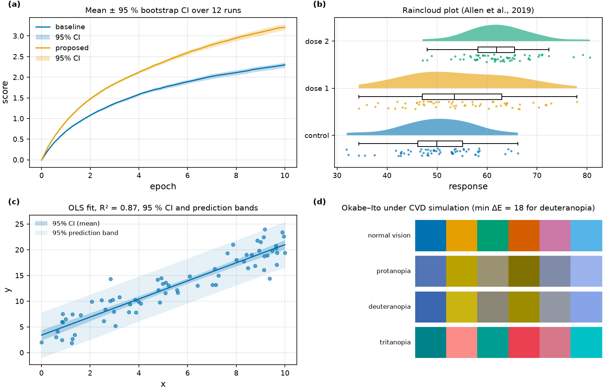

# MatplotlibMasterPro

**A research-grade Matplotlib toolkit and a 23-notebook curriculum, verified end-to-end in CI.**

[](https://github.com/SatvikPraveen/MatplotlibMasterPro/actions/workflows/ci.yml)
[](pyproject.toml)
[](https://matplotlib.org/)
[](tests/)
[](tests/)
[](https://github.com/astral-sh/ruff)
[](LICENSE)
[](CITATION.cff)
[](https://mybinder.org/v2/gh/SatvikPraveen/MatplotlibMasterPro/main?labpath=notebooks)

`mplmasterpro` gives you the pieces that a methods section actually needs and that plain Matplotlib leaves to you: figures sized to a journal's column width, uncertainty drawn as bootstrap or t-intervals instead of bare means, raincloud plots that show every observation, palettes checked numerically under simulated colour-blindness, and exports that carry their own provenance (git hash, author, timestamp) in the file metadata. The notebooks teach Matplotlib from `plot()` to GridSpec dashboards using the same package, and every notebook, script and dataset is executed or regenerated on each push.



<sub>Generated with `mplmasterpro.stats`, `mplmasterpro.colors` and `mplmasterpro.publication` (see the [gallery snippet](#the-figure-above-in-25-lines)).</sub>

---

## Contents

- [Why this exists](#why-this-exists)
- [Install](#install)
- [Sixty-second tour](#sixty-second-tour)
- [The package](#the-package)
- [The notebooks](#the-notebooks)
- [Reproducibility guarantees](#reproducibility-guarantees)
- [Repository layout](#repository-layout)
- [Scripts, examples and the Streamlit viewer](#scripts-examples-and-the-streamlit-viewer)
- [Docker and Conda](#docker-and-conda)
- [Development](#development)
- [Citing](#citing)
- [Documentation](#documentation)

---

## Why this exists

Most plotting tutorials stop at "here is a bar chart". Papers, theses and technical reports need more:

| Requirement | Plain Matplotlib | `mplmasterpro` |
| --- | --- | --- |
| Figure exactly 89 mm wide for a Nature single column | look up the width, convert to inches, remember the aspect ratio | `figure_size("nature")` |
| Mean curve with a 95 % bootstrap band over 12 seeds | write the resampling loop yourself | `plot_mean_ci(x, runs)` |
| Show distribution, summary and raw points at once | combine violin + box + jitter by hand | `raincloud_plot(groups)` |
| Prove the palette survives deuteranopia | trust a blog post | `min_pairwise_distance(pal, cvd="deuteranopia")` → ΔE |
| Know which commit produced a figure six months later | hope you wrote it down | `save_figure()` embeds `git:<sha>` in the PDF/PNG/SVG |
| Panel labels (a), (b), (c) placed consistently | `ax.text` with magic numbers | `add_panel_labels(axes)` |

## Install

```bash
git clone https://github.com/SatvikPraveen/MatplotlibMasterPro.git
cd MatplotlibMasterPro
python -m venv venv && source venv/bin/activate      # Windows: venv\Scripts\activate
pip install -e ".[all]"                              # package + notebooks + Streamlit + dev tools
```

Only need the library? `pip install -e .` pulls in just Matplotlib, NumPy, pandas and SciPy. A Conda environment (`environment.yml`) and a Docker image are described [below](#docker-and-conda).

## Sixty-second tour

```python
import numpy as np
import matplotlib.pyplot as plt
from mplmasterpro import figure_size, add_panel_labels, save_figure, theme_context
from mplmasterpro.stats import plot_mean_ci, raincloud_plot
from mplmasterpro.colors import min_pairwise_distance, OKABE_ITO

rng = np.random.default_rng(0)
x = np.linspace(0, 10, 50)
runs = np.sin(x)[None, :] + rng.normal(scale=0.3, size=(12, 50))      # 12 repeats of an experiment

with theme_context("ieee"):                                            # 8 pt serif, 600 dpi, scoped
    fig, axes = plt.subplots(1, 2, figsize=figure_size("ieee", columns=2, aspect=0.4))
    plot_mean_ci(x, runs, label="model", ax=axes[0])                   # mean ± 95 % bootstrap CI
    raincloud_plot({"A": rng.normal(size=40), "B": rng.normal(1, size=40)}, ax=axes[1])
    add_panel_labels(axes)                                             # (a), (b)
    save_figure(fig, "exports/fig1", formats=("pdf", "png"))           # metadata: title, git hash, date

print(min_pairwise_distance(OKABE_ITO, cvd="deuteranopia"))            # (16.9, ('#0072B2', '#56B4E9'))
```

Every helper follows the same contract: it takes an optional `ax`, returns the objects it creates (`(fig, ax)`, an animation, or the written paths) and never calls `plt.show()` for you.

## The package

| Module | What it gives you |
| --- | --- |
| `mplmasterpro.publication` | `figure_size()` for IEEE, Nature, Science, Elsevier, PNAS, ACM, APS, PLOS and Springer column widths; `set_size()` from a LaTeX `\columnwidth` in points; `add_panel_labels()`; `save_figure()` with embedded provenance metadata; `despine()`; `set_math_fonts()` |
| `mplmasterpro.stats` | `bootstrap_ci()`, `mean_ci()` (t / SEM / SD / bootstrap), `plot_mean_ci()`, `bar_with_ci()`, `add_significance_bar()` + `p_to_stars()`, `linear_fit_with_ci()` with confidence **and** prediction bands, `ecdf_plot()`, `qq_plot()`, `raincloud_plot()` |
| `mplmasterpro.colors` | Okabe–Ito, Paul Tol (bright/muted/vibrant/light) and IBM palettes; `simulate_cvd()` using the Machado, Oliveira & Fernandes (2009) matrices; WCAG `contrast_ratio()`; CIELAB `delta_e()` and `min_pairwise_distance()`; `cvd_preview()` |
| `mplmasterpro.theme_utils` | Ten themes (`ieee`, `nature`, `publication`, `colorblind`, `dark`, `corporate`, `minimal`, `pastel`, `high_contrast`, `default`) via `apply_theme()` or the scoped `theme_context()` |
| `mplmasterpro.plot_utils` | 50+ teaching helpers used by the notebooks: lines, bars, grouped bars, scatter with colour mapping, histograms, pies, dual axes, log scales, heat maps, annotations, animations (MP4 with GIF fallback), time-series rolling statistics, dashboards |
| `mplmasterpro.datasets` | Seeded generators for the four bundled CSVs, `load_dataset("sales_data")`, and the `mplmasterpro-datasets` CLI |

Full signatures are listed in [`docs/API.md`](docs/API.md); design decisions in [`docs/ARCHITECTURE.md`](docs/ARCHITECTURE.md).

## The notebooks

Twenty-three notebooks, each runnable top to bottom with a fresh kernel (CI does exactly that). They progress from fundamentals to research-style composites:

| # | Notebook | Covers |
| --- | --- | --- |
| 01 | `01_line_plot` | `plot()`, labels, legends, multiple series |
| 02 | `02_bar_scatter` | Bar, grouped bar, scatter with colour and size encodings |
| 03 | `03_histogram_pie` | Distributions, density normalisation, pie charts |
| 04 | `04_subplots_axes` | Subplot grids, shared axes, dual y-axes |
| 05 | `05_customization` | Colours, line styles, switching themes |
| 06 | `06_advanced_plots` | Log scales, filled areas, twin-axis fills |
| 07 | `07_annotations` | Arrows, highlighted regions, direct line labels |
| 08 | `08_images_and_grids` | `imshow`, matrices, annotated heat maps |
| 09 | `09_interactive` | ipywidgets sliders and dropdowns, `%matplotlib widget` |
| 10 | `10_export_style` | DPI, PNG/PDF/SVG export, global style sheets |
| 11 | `11_animation` | `FuncAnimation`, saving MP4/GIF |
| 12 | `12_stats_distribution` | Histograms with statistics, box and violin plots |
| 13 | `13_comparative_plots` | Grouped bars, stacked areas, small multiples |
| 14 | `14_colormaps_themes` | Sequential, diverging and qualitative colormaps |
| 15 | `15_timeseries` | Trends, rolling mean ± SD bands, multi-series |
| 16 | `16_dashboards` | `subplots` and `GridSpec` dashboards |
| 17 | `17_3d_plots` | 3-D scatter, surface, wireframe, contour |
| 18 | `18_statistical_plots` | Box, violin, notched and grouped comparisons |
| 19 | `19_error_visualization` | Error bars, confidence intervals, `fill_between` |
| 20 | `20_contour_plots` | `contour`, `contourf`, labelled level sets |
| 21 | `21_polar_plots` | Polar axes, radar charts, rose diagrams |
| 22 | `22_composite_plots` | Layered plots, twin axes, broken axes |
| 23 | `23_inset_zoom` | Inset axes, zoomed views, `mark_inset` |

Launch them with `jupyter lab` from the repository root, or click the Binder badge above.

## Reproducibility guarantees

These are enforced by [`.github/workflows/ci.yml`](.github/workflows/ci.yml) on every push and pull request:

- **Tests** — 110 tests on Python 3.10, 3.11, 3.12 and 3.13 (Linux), plus 3.12 on macOS and Windows.
- **Notebooks** — all 23 execute headlessly (`scripts/run_notebooks.py`) with ffmpeg available for the animation exports.
- **Scripts and examples** — every file in `scripts/` and `examples/` runs to completion.
- **Datasets** — `generate_all_datasets.py` must reproduce `datasets/*.csv` byte-for-byte (seeded `RandomState` streams; see `tests/test_datasets.py`).
- **Packaging** — the sdist and wheel build and pass `twine check`; the Docker image builds.
- **Provenance** — `save_figure()` writes the package version, Matplotlib version, UTC timestamp and git commit into PDF, PNG and SVG metadata, so any exported figure can be traced to the code that made it.

Details and the rationale behind each gate are in [`docs/REPRODUCIBILITY.md`](docs/REPRODUCIBILITY.md).

## Repository layout

```
MatplotlibMasterPro/
├── mplmasterpro/            # the installable package
│   ├── plot_utils.py        #   teaching helpers (return fig, ax)
│   ├── theme_utils.py       #   theme registry and context manager
│   ├── publication.py       #   journal sizes, panel labels, metadata export
│   ├── stats.py             #   bootstrap CIs, fits, raincloud, ECDF, Q-Q
│   ├── colors.py            #   palettes, CVD simulation, contrast, ΔE
│   └── datasets.py          #   seeded generators + loader + CLI
├── notebooks/               # 23 executed notebooks
├── tests/                   # 110 pytest tests (conftest forces the Agg backend)
├── scripts/                 # production scripts + run_notebooks.py
├── examples/                # minimal copy-paste examples
├── datasets/                # generated CSVs (sales, COVID, stocks, weather)
├── exports/                 # figures and animations produced by the notebooks
├── docs/                    # setup, architecture, API, reproducibility, roadmap
├── cheatsheets/             # Matplotlib quick reference
├── streamlit_app.py         # browse exports/ in a browser
├── pyproject.toml           # metadata, extras, ruff + pytest config
├── Dockerfile / docker-compose.yml / environment.yml
├── Makefile                 # make install | lint | test | notebooks | build
└── CITATION.cff / CHANGELOG.md / SECURITY.md
```

## Scripts, examples and the Streamlit viewer

```bash
python scripts/generate_dashboard.py            # multi-panel sales dashboard (exports/dashboards)
python scripts/create_publication_figures.py    # IEEE, academic and colour-blind-safe PDFs
python scripts/generate_3d_plots.py             # surface / wireframe / contour
python scripts/generate_statistical_plots.py    # box, violin, combined summaries
python scripts/batch_export.py                  # PNG + PDF + SVG in one go
python scripts/run_notebooks.py --keep-going    # execute every notebook, report failures

python examples/quick_start.py                  # the ten-line first plot
streamlit run streamlit_app.py                  # browse everything under exports/
```

See [`scripts/README.md`](scripts/README.md) and [`examples/README.md`](examples/README.md).

## Docker and Conda

```bash
docker compose up jupyter        # JupyterLab on http://localhost:8888 (token-less, local use)
docker compose up streamlit      # export viewer on http://localhost:8501
docker run --rm matplotlibmasterpro test        # run the test suite in the image
docker run --rm matplotlibmasterpro notebooks   # execute all notebooks in the image

conda env create -f environment.yml && conda activate mplmasterpro
```

The image runs as a non-root user, ships ffmpeg and Liberation/DejaVu fonts, and exposes `jupyter`, `streamlit`, `test` and `notebooks` commands through its entrypoint.

## Development

```bash
make install        # pip install -e ".[all]" + pre-commit hooks
make lint           # ruff check + format check
make test           # pytest with coverage
make notebooks      # execute notebooks into build/notebooks/ (sources untouched)
make build          # sdist + wheel
```

Contributions are welcome; please read [`docs/CONTRIBUTING.md`](docs/CONTRIBUTING.md) and the [Code of Conduct](docs/CODE_OF_CONDUCT.md). Releases follow [Semantic Versioning](https://semver.org/) and are recorded in [`CHANGELOG.md`](CHANGELOG.md); pushing a `v*` tag builds the distribution and publishes a GitHub release.

## Citing

If this project helps your research or teaching, please cite it (GitHub's *Cite this repository* button reads [`CITATION.cff`](CITATION.cff)):

```bibtex
@software{praveen2026matplotlibmasterpro,
  author  = {Praveen, Satvik},
  title   = {MatplotlibMasterPro: a research-grade Matplotlib toolkit and notebook curriculum},
  year    = {2026},
  version = {1.0.0},
  url     = {https://github.com/SatvikPraveen/MatplotlibMasterPro},
  license = {GPL-3.0-or-later}
}
```

Methods used by the package, should you need to cite them: Okabe & Ito (2008) for the colour-blind-safe palette; Machado, Oliveira & Fernandes, *IEEE TVCG* 15(6), 2009, for the CVD simulation matrices; Allen et al., *Wellcome Open Research* 4:63, 2019, for raincloud plots; Efron & Tibshirani (1993) for the percentile bootstrap.

## The figure above in 25 lines

<details>
<summary>Show code</summary>

```python
import numpy as np, matplotlib.pyplot as plt
from mplmasterpro import stats as st, colors as co, publication as pub, theme_utils as tu

tu.apply_theme("colorblind"); rng = np.random.default_rng(7)
fig, axes = plt.subplots(2, 2, figsize=(11, 7.2))

x = np.linspace(0, 10, 40)
for k, (name, amp) in enumerate([("baseline", 1.0), ("proposed", 1.35)]):
    runs = amp * np.log1p(x) + rng.normal(scale=0.25, size=(12, 40)).cumsum(axis=1) * 0.08
    st.plot_mean_ci(x, runs, label=name, ax=axes[0, 0], seed=k)

groups = {"control": rng.normal(50, 8, 60), "dose 1": rng.normal(56, 9, 60), "dose 2": rng.normal(63, 7, 60)}
st.raincloud_plot(groups, ax=axes[0, 1], xlabel="response")

xs = rng.uniform(0, 10, 70); ys = 1.8 * xs + 3 + rng.normal(scale=2.2, size=70)
st.linear_fit_with_ci(xs, ys, ax=axes[1, 0])

pal = co.OKABE_ITO[:6]
for r, kind in enumerate(["normal", "protanopia", "deuteranopia", "tritanopia"]):
    cols = pal if kind == "normal" else co.simulate_cvd(pal, kind)
    for i, c in enumerate(cols):
        axes[1, 1].add_patch(plt.Rectangle((i, 3 - r), 1, 0.85, color=c))
axes[1, 1].set(xlim=(0, 6), ylim=(0, 4)); axes[1, 1].set_axis_off()

pub.add_panel_labels(axes)
pub.save_figure(fig, "exports/research/research_showcase", formats=("png", "pdf"), dpi=150)
```

</details>

## Documentation

| Document | Purpose |
| --- | --- |
| [`docs/SETUP.md`](docs/SETUP.md) | Environment setup (venv, Conda, Docker), running notebooks, scripts and tests |
| [`docs/ARCHITECTURE.md`](docs/ARCHITECTURE.md) | Package design: the `(fig, ax)` contract, module boundaries, compatibility rules |
| [`docs/API.md`](docs/API.md) | Public function reference for every module |
| [`docs/REPRODUCIBILITY.md`](docs/REPRODUCIBILITY.md) | What CI verifies and how to reproduce figures locally |
| [`docs/ROADMAP.md`](docs/ROADMAP.md) | Planned work and open questions |
| [`docs/TROUBLESHOOTING.md`](docs/TROUBLESHOOTING.md) | Backends, fonts, animation writers, Jupyter issues |
| [`docs/RESOURCES.md`](docs/RESOURCES.md) | Curated books, courses, style guides and datasets |
| [`cheatsheets/matplotlib_cheatsheet.md`](cheatsheets/matplotlib_cheatsheet.md) | One-page syntax reference |

## License

GNU General Public License v3.0 or later. See [`LICENSE`](LICENSE).
